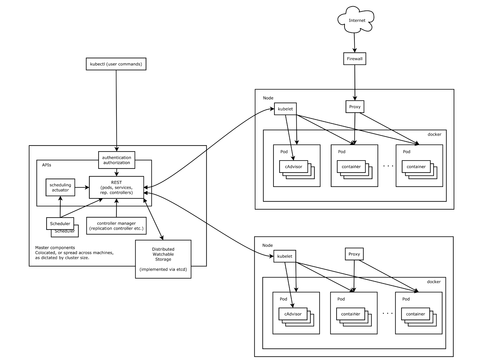

 

## Kubernetes 架构

Kubernetes 集群中有 Master 和 Node 两种角色。Master 管理 Node，Node 管理容器。

## Master

### kube-apiserver

kube-apiserver 进程为 Kubernetes 中各类资源对象提供了增删改查等 HTTP REST API。对于资源的任何操作，都需要经过 kube-apiserver 进程来处理。kubectl 也是通过 REST API 访问 kube-apiserver 来操作 Kubernetes。

### etcd

可以将 etcd 理解为 Kubernetes 的“数据库”，用于保存集群中所有的配置和各个对象的状态信息。只有 kube-apiserver 进程才能直接访问和操作 etcd。

### kube-scheduler

kube-scheduler 是 Pod 资源的调度器。它用于监听最近创建但还未分配 Node 的 Pod 资源，会为 Pod 自动分配相应的 Node。调度器在调度时会考虑各种因素，包括资源需求、硬件/软件/指定限制条件、内部负载情况等。

### kube-controller-manager

Kubernetes 集群的大部分功能是由控制器执行的。kube-controller-manager 所执行的各项操作也是基于 kube-apiserver 进程的。例如，Node 控制器会通过 kube-apiserver 进程提供的 Watch 接口，实时监控 Node 的信息并进行相应处理。

## Node

### kubelet

kubelet 是在每个 Node 上都运行的主要代理进程。kubelet 以 PodSpec 为单位来运行任务，PodSpec 是一种描述 Pod 的YAML 或 JSON 对象。kubelet 会运行由各种机制提供（主要通过 API Server）的一系列 PodSpec，并确保这些 PodSpec 中描述的容器健康运行。不是 Kubernetes 创建的容器将不属于 kubelet 的管理范围。kubelet 负责维护容器的生命周期，同时也负责存储卷（volume）等资源的管理。

### kube-proxy

kube-proxy 是集群中每个节点（node）上所运行的网络代理， 实现 Kubernetes 服务（Service） 概念的一部分。
kube-proxy 维护节点上的一些网络规则， 这些网络规则会允许从集群内部或外部的网络会话与 Pod 进行网络通信。
如果操作系统提供了可用的数据包过滤层，则 kube-proxy 会通过它来实现网络规则。 否则，kube-proxy 仅做流量转发。

### container runtime

容器运行环境是负责运行容器的软件。Kubernetes 支持许多容器运行环境，例如 containerd、 CRI-O 以及 Kubernetes CRI (容器运行环境接口) 的其他任何实现。

## 参考资料

- Kubernetes Version: v1.27
- [https://kubernetes.io/zh-cn/docs/concepts/overview/components/](https://kubernetes.io/zh-cn/docs/concepts/overview/components/)