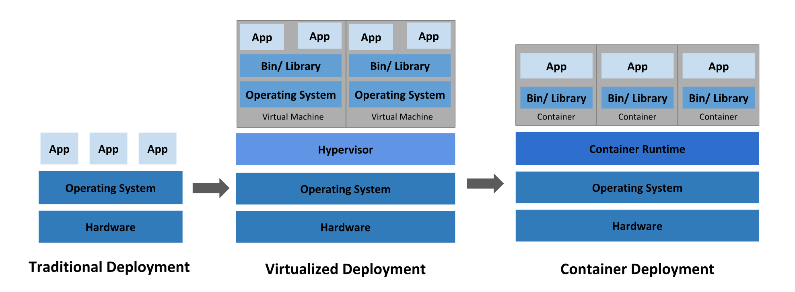

 

## Kubernetes 是什么？

> Kubernetes 是一个可移植、可扩展的开源平台，用于管理容器化的工作负载和服务，可促进声明式配置和自动化。 Kubernetes 拥有一个庞大且快速增长的生态，其服务、支持和工具的使用范围相当广泛。

> Kubernetes 这个名字源于希腊语，意为“舵手”或“飞行员”。k8s 这个缩写是因为 k 和 s 之间有八个字符的关系。 Google 在 2014 年开源了 Kubernetes 项目。 Kubernetes 建立在 Google 大规模运行生产工作负载十几年经验的基础上， 结合了社区中最优秀的想法和实践。

简单来说：Kubernetes 是谷歌开源的**容器集群管理（容器编排）系统**，是 Google 多年大规模容器管理技术 Borg 的开源版本。

## Kubernetes 与应用部署发展历史

### 传统部署时代

早期，应用程序通常直接拷贝、部署至物理机，并在物理机上运行。这种部署方式无法限制应用程序的资源使用，运行多个应用程序时会导致资源分配问题。而且运行应用程序前，还需要预先安装程序的依赖包，应用往往是固定部署在某些物理机上，灵活性低。

### 虚拟化部署时代

因此，虚拟化技术被引入了。虚拟化技术允许你在单个物理服务器的 CPU 上运行多台虚拟机（VM），每个 VM 都是独立运行的计算机（操作系统）。应用程序在不同 VM 之间被彼此隔离，提供一定程度的安全性，同时可以自由的添加和更新虚拟机，具有很高的可伸缩性。 

### 容器部署时代

容器类似于 VM，但是更宽松的隔离特性，使容器之间可以共享操作系统（OS）。容器比 VM 对比更轻量级，每个容器都具有自己的文件系统、CPU、内存、进程空间等。

### 容器编排时代

在单机上运行容器，无法发挥它的最大效能，只有形成集群，才能最大程度发挥容器的良好隔离、资源分配与编排管理的优势。容器编排系统的出现就是为了解决以上问题，而 Kubernetes 是最流行的容器编排系统。

## Kubernetes 能干什么？

- 基于容器的应用部署、维护和滚动升级
- 负载均衡和服务发现
- 自我修复和自动伸缩
- 密钥与配置管理
- 支持广泛的存储系统
- 插件机制保证扩展性

## 参考

- Kubernetes Version: v1.27
- [https://kubernetes.io/zh-cn/docs/concepts/overview/](https://kubernetes.io/zh-cn/docs/concepts/overview/)